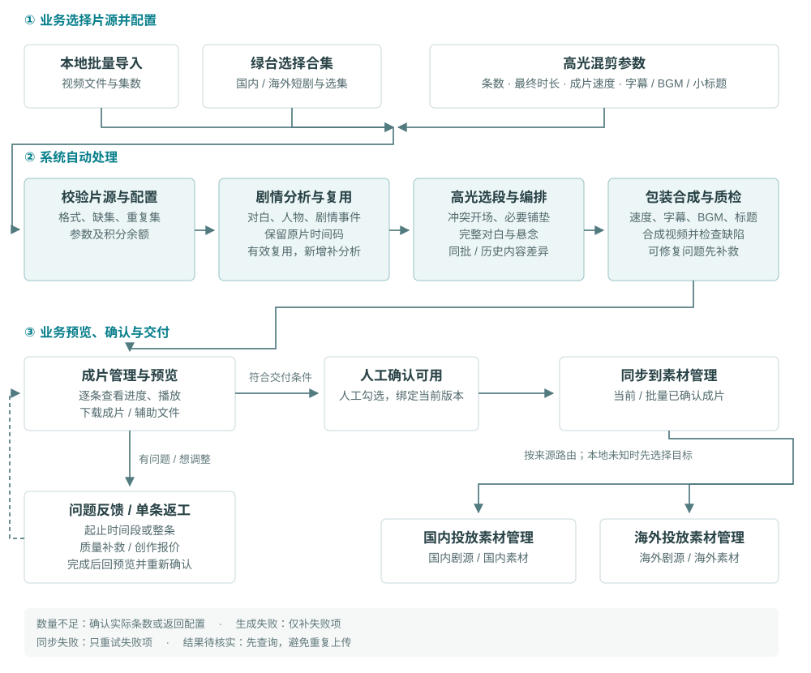

# 智能混剪 V7 需求评审说明

2026-10-08 · [原型与编号说明](https://hongjuan303.github.io/html-prototypes/ai-smart-mixed-cut-v7/review.html)

面向国内、海外短剧投放剪辑。评审按页面和橙色序号讨论；共用规则用 R 编号定位，测试用 T 编号核对。逐字段定义、枚举、数据源、操作及用例预期见原型右侧说明，可下载[字段与测试说明](https://hongjuan303.github.io/html-prototypes/ai-smart-mixed-cut-v7/FIELD-SPEC.md)。待定参数放在附录。

## 01. 范围与主流程

容量万相工具箱新增“智能混剪”，点击新开页面，沿用平台账户、权限和积分。三个菜单：制作素材、剧目管理、成片管理。

### 1.1 高光混剪业务流程

绿台来源决定交付系统；本地类型未知时先选择目标。只有当前版本人工确认后才能同步。AI 解说复用此流程，在编排后增加写稿、画面匹配和配音。

### 1.2 制作方式

| 制作方式 | 内容与声音 |
| --- | --- |
| 高光混剪 | 提炼重要剧情，保留原声、完整对白、必要铺垫和悬念 |
| AI 解说：解说＋原片 | 解说引入或承接剧情，原片段保留人声；原片为主 |
| AI 解说：全解说 | 完整口播贯穿，原片提供对应画面，原片音轨静音 |

AI 解说首次必须选择结构；不默认短解说。内容分析与编排在生成流程内完成。投放回传评分、自动学习团队偏好不在本版；V6 保留供对照。

## 02. 制作素材

| 配置 | 展示与规则 |
| --- | --- |
| 片源 | “选择合集”顶部并列国内短剧、海外短剧、本地上传；国内/海外加载各自绿台数据。切换来源清空弹窗选择；取消保留原片源 |
| 集数 | 前10/20/30集或起止集数；正整数、起始≤结束、不越界、不含缺集/未准备集。合集搜索支持名称或ID |
| 本地上传 | 按剧目批量导入并核对文件与集数；重复、缺集、无法识别项提示。类型未知，交付时再选国内/海外 |
| 条数 | 1–20条；5/10/20快捷项，支持输入、加减 |
| 最终成片时长 | 高光/混合：约1/3/5/10分钟、3–5/5–7分钟；全解说：约30/60/90/120秒、3/5/10分钟、3–5/5–7分钟。按速度处理后的实际总长计算 |
| 成片速度 | 0.8/1/1.1/1.2/1.5×。高光用于原片，全解说用于口播，混合默认共同生效 |
| 单独解说语速 | 仅混合可勾选展开；首次1×，保留覆盖值。关闭恢复共同速度，再开启恢复覆盖；切换全解说只用成片速度 |
| 解说长度与位置 | 长度自动安排，不设口播时长字段；混合可选开头引入或剧情中承接。切换结构保留各自最终时长 |
| 字幕 | 高光/混合关闭新增字幕时保留原字幕；全解说控制新增解说字幕。字幕与最终人声对齐 |
| BGM | 勾选即打开选曲；确认才开启，取消保留原状态。支持自动匹配或选曲；更换取消不覆盖旧选择 |
| 引流小标题 | 勾选即显示输入框；去首尾空格后必填、最多24字。关闭保留文字但不用于成片；避开字幕 |
| 预计成片结构 | 随配置更新数量、时长、声音、速度、BGM、字幕及标题；具体片段生成后查看 |

生成按钮先校验配置、片源和余额，缺项说明原因并禁用。有效分析复用，新集数补分析；费用见 R-08。

数量充足直接创建任务并进入成片管理。数量不足先展示请求N条、可生成M条、原因、已分析费及M条制作费；用户返回调整或确认生成M条。M=0不建任务、不收制作费；已完成有效分析保留。

## 03. 剧目与成片管理

| 页面 / 操作 | 规则 |
| --- | --- |
| 剧目列表 | 按剧聚合多批任务；同源同合集归集，国内/海外及独立手动资产不按同名合并。支持搜索、来源/状态筛选 |
| 剧目详情 | 默认制作任务，仅“制作任务、成片与交付”两页签；继续制作带入该剧配置 |
| 任务列表 | 按剧目、制作方式、任务状态筛选；制作方式只有高光、AI解说，历史原片任务归入高光结果 |
| 展开任务 | 一次展开一批，始终显示本批全部成片；保留逐条进度、费用明细、失败处理和批量操作 |
| 成片行 | 封面/名称进入预览；展示时长、同步状态与操作。无检查按钮/检查状态列，制作中、失败或质量问题在名称下短提示 |
| 继续预览 | 从本批首个可预览且当前版本未确认项进入；全部确认或无可预览项时不展示 |
| 再做一批 | 复制配置回制作页，重新校验、报价，不直接生成；原任务内容、版本和费用保留 |
| 补生成 / 取消 | 补生成仅处理失败项、沿用原批快照；取消仅停止未完成项，成功项保留，费用按 R-08 |
| 批量操作 | 只作用于当前任务；切换任务清空选择。“选已确认未同步”只勾选、不过滤。同步前所有选中项须符合 R-06/R-09 |

## 04. 预览与问题反馈

### 4.1 预览与确认

- 播放、拖动或点击片段定位；换成片从0开始，同片换页签保留进度。高光/混合看接点、时间线、文案与包装；全解说看逐段图文对应、全文及声音。
- 同批可预览成片组成固定队列，从点击条开始；后续完成项不插队。切换保留草稿，稍后处理不自动确认。
- 确认必须人工勾选。确认并下一条进入下条；确认并同步先确认，再打开上传表单，取消上传保留确认。队尾显示确认/待处理数。
- 选取依据默认折叠，带原片集数、区间与成片定位；相似内容可对比开场、结尾及解说全文。查看不生成、不扣费、不改版本。

### 4.2 时间段反馈

入口：“这里有问题”或问题区反馈。打开暂停播放，按制作结构及包装显示适用类型。

| 范围 / 输入 | 校验 |
| --- | --- |
| 局部片段 | 起始必填，默认当前进度；结束选填，填写时须晚于起始且不超过总时长。支持分:秒、小数秒或直接秒数；非法/越界拦截 |
| 整条素材 | 隐藏时间输入，范围为0至总时长；切回局部保留输入。未填结束只记录起始位置 |
| 说明与判重 | 说明选填、最多200字；同类相同范围不重复，不同范围可分别记录。取消不写入、不扣费 |

24项分为18项质量、6项创作；解说专属项仅适用结构显示，BGM/标题项随开关展示。

| 分类 | 问题类型 |
| --- | --- |
| 质量：剧情/解说 | 对白吞字、剧情不连贯/缺铺垫、成片内重复、解说缺句、事实错误、人物称呼/关系错误、解说原片衔接不自然、图文不符 |
| 质量：字幕/声音 | 字幕错漏字、缺失/不同步、遮挡；配音读音错误、人声缺失/爆音/音量异常、BGM压人声、BGM缺失 |
| 质量：画面/标题 | 黑屏/画面缺失、卡帧/闪帧、小标题遮挡 |
| 创作调整 | 开场不吸引、节奏/速度不合适、结尾悬念不足、解说风格、BGM情绪、与其他成片相似 |

质量反馈进入待处理并撤销确认，阻止交付；创作调整独立记录、撤销确认，但不判系统质量失败。创作可确认采用当前版，或报价后重做。两类均不因记录而修改媒体或升版，见 R-06/R-07。

## 05. 同步素材管理

国内/海外绿台来源自动打开对应系统上传表单；手动类型未知时先选择国内素材或海外素材。两个系统的目录、人员、剧集和标签独立，不按视频语言推断路由。

| 必填字段 | 规则 |
| --- | --- |
| 上传目录 | 选择目标系统有效目录 |
| 设计师（剪辑） | 选择目标系统有权限的人员 |
| 关联剧集 | 自动映射能确定的剧集；否则显式选择，不只填剧名 |
| 素材标签 | 至少一个有效标签；标签管理沿用目标系统能力 |
| 上线时间 | 每次明确填写；影响素材保护规则，不自动填当天或沿用上次 |

默认带入当前/选中成片，不配置上传区域。提交前再次检查必填、权限、当前内容版本及同步资格。

同任务同目标在提交校验通过并发起同步时记忆有效目录/人员/标签；新上传的上线时间不复用，失败重试沿用原提交快照；取消不记忆表单字段。独立保存的新增标签保留。切换目标清空旧系统字段。

成功保留目标素材ID、版本、提交字段和时间；明确失败只重试失败项。超时待核实先查询、不重传；同步中/待核实锁定对应内容和确认变更。相同成功版本不重复上传，新版独立确认同步，不覆盖旧素材。

## 06. 共用规则

### 6.1 R-01 片源与交付

接真实绿台、本地批量片源，交付可播放/下载的MP4。默认保留画幅方向，最高1080p；编码、大小验证两套素材系统。JSON/SRT仅辅助。

### 6.2 R-02 内容质量

完整对白、事实与因果连贯、人声清晰、字幕对齐、无剪辑新增黑屏卡帧是质量底线；解说须匹配画面并与原声自然衔接。业务用国内/海外及三种结构的好坏样片验收，自动检查不替代人工确认。

### 6.3 R-03 时长与速度

按最终总长编排原片、口播、字幕及BGM，不在达标成片上再次整体变速。混合自动安排解说并保持原片为主；全解说按目标与语速规划完整文案。完整句/事实优先，不足时调整片源或时长，不硬截句、异常加速或凑内容。

### 6.4 R-04 内容差异

综合剧情事件、开场、结尾、区间及叙事角度；全解说增加文案语义/顺序。同事件可保留不同剪法，只换BGM/标题/速度不算新方向。同批排重、避开同片源历史完全重复；不足按实际数量确认生成，不承诺每批20条互异。

### 6.5 R-05 声音与字幕

默认按源语言制作，语种/音色需样片确认。全解说静音原片整轨；BGM避让人声，AI解说默认开启，主动关闭例外待确认。保留烧录字幕，新增字幕对齐人声；冲突处理不默认承诺擦字。

### 6.6 R-06 确认与内容版本

确认条件：已生成、无质量问题、无未应用草稿、无修复/返工或同步锁定。保存草稿不扣费、不升媒体版本；应用修改前核对时长与费用，成功重制受影响音画后升版、撤销旧确认，失败保留旧片与草稿。反馈/撤销反馈不升版，关闭问题不自动恢复确认。

### 6.7 R-07 补救与创作返工

核验为系统质量问题的局部/整条补救免费，无法交付退该条制作费；创作重做先报价再确认。只重做本条，成功升版重新确认，失败保留旧片；不影响其他成片或旧同步记录。不能仅凭用户选质量枚举取得免费创作重做。

### 6.8 R-08 积分结算

分析前展示最高报价并校验余额；有效新增分析完成结算，复用不重复收费。正式取消按有效完成部分结算，未完成不收。制作/创作返工先冻结，成功结算，失败/取消释放；内部重试不重复扣费。已扣退款与未扣释放分开，实际费用不超过授权上限。草稿暂存、有效复用、同步不收制作费。平均消费仅在费用明细：净扣除÷当前版本已确认条数，零条显示“—”。

### 6.9 R-09 账户与同步资格

沿用主平台账户、扣费主体及角色权限；校验片源可见范围和目标系统操作权限。确认绑定当前版本，同步以版本防重；提交快照/回执可追溯，旧版不会被编辑或新同步撤回。存储期限由平台确定。

### 6.10 R-10 后台任务与异常

任务在后台执行，关闭页面/熄屏不取消。逐条完成可预览；自动检查、可修复补救后再交人工，不确定项明确待处理，不合格不结算为成功。失败只补失败项，取消保留成功项及有效分析，释放未交付额度；未知同步结果按第05节处理。

### 6.11 R-11 分析与标准版本

来源、资产、原片版本及语言决定分析复用；内部候选附原片区间和事实依据。新集数补分析；版本更新后未开工规划重新计算，进行中/历史保留快照，失败补生成沿原批依据。业务定义标准，产品整理规则，研发版本化并用样片回归后生效；反馈不自动训练或修改团队标准，可追溯/回退。

## 07. 评审验收清单

按规则核对结果，不重复阅读每个页面。T编号延续原稿，原型交互通过不能代替真实视频验收。

| 验收编号 | 关键结果 |
| --- | --- |
| T-01 / T-15 | 真实片源→生成→修改→确认→国内/海外同步跑通，文件、版本、回执一致（R-01） |
| T-02 / T-18 | 好坏样片覆盖三结构/语种；硬性缺陷有定位和复验，自动检查不代替人工（R-02） |
| T-03 | 共同速度/混合覆盖均按最终总长验收；完整句优先（R-03） |
| T-04 / T-20 / T-21 | 同事件不同剪法/同文案换包装等正反例；排重、缓存及原片依据正确（R-04/R-11） |
| T-05 | 配音、静音、字幕、BGM与配置一致；烧录字幕冲突按约定处理（R-05） |
| T-06 / T-07 / T-16 | 草稿不升版；应用成功升版后重确认；未应用/质量问题/锁定拦截交付；连续预览与同步取消不误操作（R-06） |
| T-08 / T-17 | 区间/整条反馈正确；质量补救与创作收费分别处理；返工失败保留旧片（R-07） |
| T-09 / T-19 | 冻结、结算、释放、退款无重复；实际不超报价，净费用可核对（R-08） |
| T-10 / T-14 | 账户、资产和两套系统权限/字典校验；保留与到期规则正确（R-09） |
| T-11 / T-12 | 关页/熄屏任务继续；失败恢复及规模/并发耗时验证（R-10） |
| T-13 / T-22 | 标准/分析生效范围、历史快照及反馈分类正确，更新可回退（R-11） |

## 08. 待确认与演示边界

### 8.1 对接与参数清单

以下未核定项由对应负责人确认，不能直接当作上线承诺。

| 编号 | 确认项 / 负责人 |
| --- | --- |
| D-01 / D-11 | 输入规模、格式/大小/编码、并发/耗时：建议用30集/120分钟、10条3–5分钟验证；首条10分钟/整批30分钟是待测目标。业务/研发 |
| D-02 / D-03 | 首次可用率、时长容差与混合原声占比：建议首轮≥30条、首次80%；约定时长±10%、区间不外扩、原声占比≥50%均需样片确认。业务/产品 |
| D-04 / D-05 | 首发语种、跨语种范围、默认音色和试听。业务/研发 |
| D-06 | 广告可用BGM曲库、主动关闭BGM例外、烧录字幕冲突处理。业务/平台 |
| D-07 / D-08 | 国内0.6元/可用条、海外30秒解说3元的成本口径；积分费率、分析单位、主动修改费、退款。业务/计费负责人 |
| D-09 / D-10 | 绿台/素材系统接口、用户与剧集映射、角色/扣费主体、保存期限。平台/系统负责人 |
| D-12 / D-13 | 近似重复阈值与历史范围、自动修复次数（暂建议2次）、质量争议和退款责任。业务/产品/平台 |

研发技术设计关联R/T编号，确定模型、时间码/切点、字幕配音/合成、队列存储、计费和同步防重方案；以真实样片验证效果、耗时及成本。

### 8.2 原型边界

当前片源、模型分析、故事板、配音、质检、积分及同步均为演示，不产真实MP4。本地文件仅预览；文案“保存”在Demo模拟应用，正式实现按R-06分开暂存/应用。刷新中断处理不是后台任务规则。

示例费率：分析1分/集，高光32分/条，混合50分/条，全解说32＋向上取整（目标秒数÷30）×18分/条。自动口播预算约目标10%、5–30秒，均非正式费率、能力上限或生产比例。
